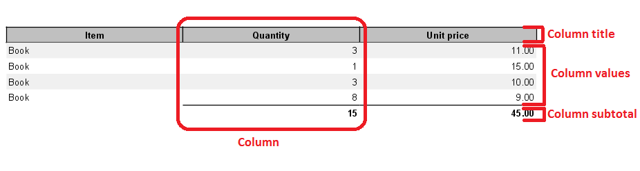

=======
Columns
=======

DynamicReports has an ability to display data in a multi-column layout. There is no limit in number of columns added to the report, only keep in mind that the more columns you add to the report, the less space will be available for each column.
All columns automatically fit the available page width.

The picture above shows what is a column and how it is divided.

**Configuration options of a column title**

= ============================================ ====================================
# method	                                   description
= ============================================ ====================================
1 | setTitle(String title),                     Sets the column title
  | setTitle(DRIExpression<?> titleExpression)  
2 setTitleStyle(StyleBuilder titleStyle)       Sets the column title style
3 | setTitleRows(Integer rows),                | This method is used to define the 
  | setTitleFixedRows(Integer rows),           | height of a column title. The height 
  | setTitleMinRows(Integer rows)              | is set to the rows multiplied by height of the font              
4 | setTitleHeight(Integer height),            Sets the height of a column title
  | setTitleFixedHeight(Integer height),
  | setTitleMinHeight(Integer height)	          
= ============================================ ====================================

**Configuration options of column values**

= ============================================= =================================================
# method	                                     description
= ============================================= =================================================
1 setStyle(StyleBuilder style)                  Sets the column value style
2 | setPrintWhenExpression(DRIExpression	    | Sets the print when expression. The expression
  |    <Boolean> printWhenExpression)           | must be a type of Boolean and it decides
                                                | whether or not a column value will be print
3 | setRows(Integer rows),                      | This method is used to define the height of a
  | setFixedRows(Integer rows),                 | column value. The height is set to the rows 
  | setMinRows(Integer rows)                    | multiplied by height of the font
4 | setHeight(Integer height),                  Sets the height of a column value
  | setFixedHeight(Integer height),
  | setMinHeight(Integer height)	
5 | setPrintRepeatedDetailValues(Boolean        | Specifies whether or not print a value if the 
  |    printRepeatedDetailValues)               | value is the same as the previous value
6 | setHorizontalAlignment(HorizontalAlignment 	Sets the column value horizontal alignment
  |    horizontalAlignment)
7 | setPattern(String pattern),                 Sets the column value format pattern
  | setPattern(DRIExpression<String> 	
  | patternExpression)
8 | setValueFormatter(DRIValueFormatter         Sets the column value format expression
  |    <?, ? super U> valueFormatter)
9 setHyperLink(HyperLinkBuilder hyperLink)      Sets the column value hyperlink
a | setStretchWithOverflow(Boolean 
  | stretchWithOverflow)	
b | addProperty(DRIPropertyExpression           Adds a jasper property to the column value 
  |     propertyExpression),
  | addProperty(String name, 
  |    DRIExpression<String> valueExpression),
  | addProperty(String name, 	 
  |    String value)
= ============================================= =================================================

**Configuration options of a column**

= ============================================ ===============================================
# method	                                   description
= ============================================ ===============================================
1 | setColumns(Integer columns),               | This method is used to define the width of a
  | setFixedColumns(Integer columns),          | a column. The width is set to the columns  
  | setMinColumns(Integer columns)             | multiplied by width of the character m for 
                                               | the used font
2 | setWidth(Integer width),                   Sets the width of a column
  | setFixedWidth(Integer width),
  | setMinWidth(Integer width)	
= ============================================ ===============================================

| **Examples**
| Column examples

Text column
-----------

It is represented by a TextColumnBuilder instance and it is used to show values from the data source.

**Builders**

= ============================================= ================================================
# method	                                     description
= ============================================= ================================================
1 | col.column(String fieldName, Class<T>       | Creates a new column
  | valueClass),                                | - title (optional) - the column title
  | col.column(String title, String fieldName,  | - fieldName - the name of the field
  | Class<T> valueClass)                        | - valueClass - the field value class
2 | col.column(String fieldName, DRIDataType<?  | Creates a new column
  |    super T, T> dataType),                   | - title (optional) - the column title
  | col.column(String title, String fieldName,  | - fieldName - the name of the field
  |    DRIDataType<? super T, T> dataType)      | - dataType - the field data type
3 | col.column(FieldBuilder<T> field),          | Creates a new column
  | col.column(String title,                    | - title (optional) - the column title
  |    FieldBuilder<T> field)                   | - field - the field definition
4 | columnInstance.add(TextColumnBuilder<?      | Creates a new column by adding a value or a 
  | extends Number> column),                    | column value to the columnInstance column
  | columnInstance.add(Number number)	
5 | columnInstance.subtract(TextColumnBuilder<? | Creates a new column by subtracting a value or
  |    extends Number> column),                 | a column value from the columnInstance column
  | columnInstance.subtract(Number number)	
6 | columnInstance.multiply(TextColumnBuilder<? | Creates a new column by multiplying the 
  |    extends Number> column),                 | columnInstance column with a value or a column 
  | columnInstance.multiply(Number number)      | value
7 | columnInstance.divide(int scale,            | Creates a new column by dividing the 
  |   TextColumnBuilder<? extends Number> col), | columnInstance column with a value or a column 
  | columnInstance.divide(int scale,            | value
  |   Number number)	
= ============================================= ================================================

| **Examples**
| Quick usage:

.. code-block:: java
   :linenos:

    report() 
    .columns( 
        col.column("Item", "item", type.stringType()), 
        col.column("Quantity", "quantity", type.integerType()))
    .setDataSource(...)

Another example: `ColumnDataTypesReport <#>`_

Expression column
-----------------
It is represented by a TextColumnBuilder instance and the displayed values are defined in an expression.

**Builders**

= ============================================ ===============================================
# method	                                   description
= ============================================ ===============================================
1 | col.column(DRIExpression<T> expression),   | Creates a new expression column
  | col.column(String title, DRIExpression<T>  | - title (optional) - the column title
  |   expression)                              | - expression - the value expression
= ============================================ ===============================================

| **Examples**
| Quick usage:

.. code-block:: java
   :linenos:

    report()
    .columns( 
        col.column("Expression column", new ExpressionColumn()))
    .setDataSource(...)
    private class ExpressionColumn extends AbstractSimpleExpression<String> {
    public String evaluate(ReportParameters reportParameters) { 
        return ...;
    }        
    }

Another example: `ExpressionColumnReport <#>`_

Percentage column
-----------------

It is represented by a PercentageColumnBuilder instance. It calculates percentage values from the field or column values.

**Builders**

= ============================================== ===============================================
# method	                                     description
= ============================================== ===============================================
1 | col.percentageColumn(ValueColumnBuilder<?,   | Creates a new percentage column from the 
  |    ? extends Number> column),                | column values
  | col. percentageColumn(String title,          | - title (optional) - the column title
  | ValueColumnBuilder<?, ? extends Number> col) | - column - the column definition	
2 | col.percentageColumn(String field, Class<?   | Creates a new percentage column from the 
  |    extends Number> valueClass),              | field values
  | col.percentageColumn(String fld, String s1,  | - title (optional) - the column title
  | Class<? extends Number> valueClass)          | - fieldName - the name of the field
                                                 | - valueClass - the field value class
3 | col.percentageColumn(FieldBuilder<?          | Creates a new percentage column from the 
  |    extends Number> field),                   | field values
  | col.percentageColumn(String title,           | - title (optional) - the column title
  | FieldBuilder<? extends Number> field)        | - field - the field definition
= ============================================== ===============================================

**Configuration options**

= ============================================ ===============================================
# method	                                   description
= ============================================ ===============================================
1 setTotalType(PercentageTotalType totalType)  Sets the total type. Has effect only when the report contains at least one group
2 setTotalGroup(GroupBuilder<?> totalGroup)	   Sets the total group. Has effect only when the report contains at least one group
= ============================================ ===============================================

| **Examples**
| Quick usage:

.. code-block:: java
   :linenos:

    TextColumnBuilder<Integer> quantityColumn = col.column("Quantity", "quantity", type.integerType()); 
    PercentageColumnBuilder quantityPercColumn = col.percentageColumn("Quantity [%]", quantityColumn);
    report()
    .columns( 
        quantityColumn, quantityPercColumn)
    .setDataSource(...)

Another example: `PercentageColumnsReport <#>`_

Row number column
-----------------

It is represented by a TextColumnBuilder instance and displays row numbers.
Builders

= ============================================ =================================================
# method	                                   description
= ============================================ =================================================
1 | col.columnRowNumberColumn(),               | Create a new row number column, the row number 
  | col.columnRowNumberColumn(String title)	   | is reset on each new column 
  |                                            | - title (optional) - the column title 
2 | col.pageRowNumberColumn(),                 | Create a new row number column, the row number 
  | col.pageRowNumberColumn(String title)      | is reset on each new page
  |                                            | - title (optional) - the column title
3 | col.reportRowNumberColumn(),               | Creates a new row number column
  | col.reportRowNumberColumn(String title)    | - title (optional) - the column title
= ============================================ =================================================

| **Examples**
| Quick usage:

.. code-block:: java
   :linenos:

    report()
    .columns( 
        col.reportRowNumberColumn("Report row"))
    .setDataSource(...)

Another example: `RowNumberColumnsReport <#>`_

Boolean column
--------------

It is represented by a BooleanColumnBuilder instance and shows a boolean value either as a text or as an image.

**Builders**

= =============================================== =================================================
# method	                                      description
= =============================================== =================================================
1 | col.booleanColumn(String field),              | Creates a new boolean column
  | col.booleanColumn(String titl, String fld)    | - titl (optional) - the column title
  |                                               | - fld - the name of the field
2 | col.booleanColumn(FieldBuilder<Boolean> fld), | Creates a new boolean column
  | col.booleanColumn(String title, FieldBuilder  | - title (optional) - the column title
  |       <Boolean> fld)	                      | - fld - the field definition
3 | col.booleanColumn(DRIExpression<Boolean> ex), | Creates a new boolean column
  | col.booleanColumn(String title, DRIExpression | - title (optional) - the column title
  |     <Boolean> expression)                     | - expression - the boolean value expression	
= =============================================== =================================================

**Configuration options**

= ============================================ =================================================
# method	                                   description
= ============================================ =================================================
1 | setComponentType(BooleanComponentType      | Sets the boolean presentation type.
  | booleanComponentType)                      | BooleanComponentType.TEXT_* - shows a text value	
  |                                            | BooleanComponentType.IMAGE_* - shows an image
2 | setImageDimension(Integer we, Integer ht), | Sets the boolean image dimension. Has effect 
  | setImageWidth(Integer width),              | only when the boolean value is presented as an 
  | setImageHeight(Integer height)             | image
= ============================================ =================================================

| **Examples**
| Quick usage:

.. code-block:: java
   :linenos:

    report()
    .columns( 
        col.booleanColumn("Boolean", "boolean"), 
    col.booleanColumn("Boolean", "boolean").setComponentType(BooleanComponentType.IMAGE_STYLE_1))
    .setDataSource(...)

Another example: `BooleanColumnReport <#>`_

Component column
----------------

It is represented by a ComponentColumnBuilder instance and is used to display custom components (e.g. images or complex content) in columns.

**Builders**

= ============================================ =================================================
# method	                                   description
= ============================================ =================================================
1 | col.componentColumn(ComponentBuilder<?,    | Creates a new component column
  | ?> component),                             | - title (optional) - the column title
  | col.componentColumn(String title,          | - component - the component definition
  | ComponentBuilder<?, ?> component)	
= ============================================ =================================================

| **Examples**
| Quick usage:

.. code-block:: java
   :linenos:

    ImageBuilder image = cmp.image(...);
    ComponentBuilder<?, ?> component = ...;
    report()
    .columns( 
        col.componentColumn("Image", image),
        col.componentColumn("Component", component)) 
    .setDataSource(...)

| Another example: `ComponentColumnReport <#>`_
| Tags: column
