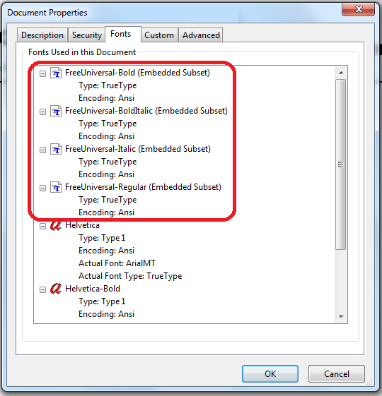

=====
Fonts
=====

Font configuration is very important for a proper report generation and exports. In pdf exports in particular, where it is possible to embed fonts into a document. Keep in mind that if a font is not found, a default system font is used, and this may cause a lot of problems with the layout of the report.
The font configuration itself is not very complicated, just follow these few steps:

Say, we want to register a font named *FreeUniversal*.
First we need to create a font configuration file fonts.xml and add it in the root of the classpath. Using this configuration, we should register all fonts that are used in the reports. It's recommended to register all font styles (normal, bold, italic and bolditalic).
The configuration file will look like this:

.. code-block:: xml
   :linenos:

    <fontFamilies>
        <fontFamily name="FreeUniversal">
            <normal>net/sf/dynamicreports/examples/fonts/FreeUniversal-regular.ttf</normal>
            <bold>net/sf/dynamicreports/examples/fonts/FreeUniversal-Bold.ttf</bold>
            <italic>net/sf/dynamicreports/examples/fonts/FreeUniversal-Italic.ttf</italic>
            <boldItalic>net/sf/dynamicreports/examples/fonts/FreeUniversal-BoldItalic.ttf</boldItalic>
            <pdfEncoding>Cp1252</pdfEncoding>
            <pdfEmbedded>true</pdfEmbedded>
        </fontFamily>
    </fontFamilies>

Now we have to add the font files to the classpath or pack them into a separate jar file and put the jar to the classpath. The font net/sf/dynamicreports/examples/fonts/FreeUniversal-regular.ttf means that the font file FreeUniversal-regular.ttf has to be found in package net.sf.dynamicreports.examples.fonts.

And finally, we need to create a jasperreports_extension.properties file and register the font configuration file:

.. code-block:: java
   :linenos:

    net.sf.jasperreports.extension.registry.factory.simple.font.families=net.sf.jasperreports.engine.fonts.SimpleFontExtensionsRegistryFactory
    net.sf.jasperreports.extension.simple.font.families.drfonts=fonts.xml

After applying the configuration above, you can use the font in this way:

.. code-block:: java
   :linenos:

    StyleBuilder plainStyle = stl.style()
    .setFontName("FreeUniversal");
    report().
        title(cmp.text("text - plain").setStyle(plainStyle))

If you want to set the font FreeUniversal as a deafult font, create a dynamicreports-defaults.xml file and set the default font name:

.. code-block:: xml
   :linenos:

    <DynamicReports>
    <!-- DEFAULT FONT -->
        
    </DynamicReports>

If you don't set the style in a column or any other text component, the default font is used

.. code-block:: java
   :linenos:

    report().
        title(cmp.text("text - default font"))

You can check if the configuration is working properly by exporting the report into pdf. Open the pdf document and look at the document properties and select fonts, there should be a list of all embedded FreeUniversal fonts.

For more information about font configuration visit the following site:
Font extensions

| **Examples**
| `FontsReport <#>`_
| Tags: style