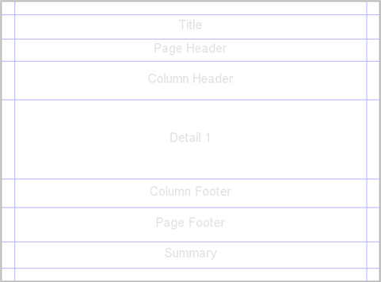

============
Report Bands
============

Each report consists of several sections (bands). Each band has its particular 
location, signification, dimension, and can contain components. The height of 
the band is based on the component's dimension that it contains and can grow 
when the components are stretched.

| **Examples**
| Quick usage:

.. code-block:: java
   :linenos:

    report()
    .title(cmp.text("This is a title band")) 
    .pageHeader(cmp.text ("This is a page header band")) 
    .pageFooter(cmp.text ("This is a page footer band"))

Another example: `BandReport <https://web.archive.org/web/20180521085052/http://www.dynamicreports.org/examples/bandreport>`_

A report contains these bands:

Title
-----

The band is printed on the first page and only once.

**Configuration options**

= ============================================ =================================================
# method	                                   description
= ============================================ =================================================
1 titleOnANewPage()	                           Prints the title band on a separate page
2 setTitleOnANewPage(Boolean titleOnANewPage)  Sets whether or not the title band is printed on a separate page
3 setTitleSplitType(SplitType splitType)       | Sets the title band split type
                                               | SplitType.PREVENT - prevents the band from splitting
                                               | SplitType.STRETCH - the band can be split, but never within its declared height.
                                               | SplitType.IMMEDIATE - the band can be split
4 setTitleStyle(StyleBuilder style)	           Sets a title band style
5 | title(ComponentBuilder<?, ?> ... comp),    Adds components to the title band
  | addTitle(ComponentBuilder<?, ?> ... comp)	
= ============================================ =================================================

Page header
-----------

The band is printed on each page at the top of the page.

**Configuration options**

= ============================================ =================================================
# method	                                   description
= ============================================ =================================================
1 setPageHeaderSplitType(SplitType splitType)  | Sets the page header band split type
                                               | SplitType.PREVENT - prevents the band from splitting
                                               | SplitType.STRETCH - the band can be split, but never within its declared height.
                                               | SplitType.IMMEDIATE - the band can be split
2 setPageHeaderStyle(StyleBuilder style)       Sets a page header band style
3 | pageHeader(ComponentBuilder<?, ?> ... co), Adds components to the page header band
  | addPageHeader(ComponentBuilder<?
  | , ?> ... components)	
= ============================================ =================================================

Page footer
-----------

The band is printed on each page at the bottom of the page.

**Configuration options**

= ============================================ =================================================
# method	                                   description
= ============================================ =================================================
1 setPageFooterSplitType(SplitType splitType)  | Sets the page footer band split type
                                               | SplitType.PREVENT - prevents the band from splitting
                                               | SplitType.STRETCH - the band can be split, but never within its declared height.
                                               | SplitType.IMMEDIATE - the band can be split
2 setPageFooterStyle(StyleBuilder style)       Sets a page footer band style
3 | pageFooter(ComponentBuilder<?, ?> ... co), Adds components to the page footer band
  | addPageFooter(ComponentBuilder<?, 
  |    ?> ... components)	
= ============================================ =================================================

Column header
-------------

The band is printed on each page at the bottom of the page and it's placed above the page footer band.

**Configuration options**

= ============================================ =================================================
# method	                                   description
= ============================================ =================================================
1 | setColumnFooterSplitType(SplitType type)   | Sets the column footer band split type
                                               | SplitType.PREVENT - prevents the band from splitting
                                               | SplitType.STRETCH - the band can be split, but never within its declared height.
                                               | SplitType.IMMEDIATE - the band can be split
2 floatColumnFooter()                          Prints the column footer band at the bottom of the column
3 setFloatColumnFooter(Boolean floatColFooter) Sets whether or not the column footer band is printed at the bottom of the column
4 setColumnFooterStyle(StyleBuilder style)     Sets a column footer band style
5 | columnFooter(ComponentBuilder<?, ?>        Adds components to the column footer band
  |        ... components),
  | addColumnFooter(ComponentBuilder<?, ?> 
  |        ... components)	
= ============================================ =================================================

Group header
------------

The band is printed for each data group. It's placed above the grouped data and between the column header and footer.

= ============================================ =================================================
# method	                                   description
= ============================================ =================================================
1 | setGroupHeaderSplitType(GroupBuilder<?>    | Sets the group header band split type
  | grop, SplitType splitType)                 | SplitType.PREVENT - prevents the band from splitting	
                                               | SplitType.STRETCH - the band can be split, but never within its declared height.
                                               | SplitType.IMMEDIATE - the band can be split
2 | setGroupHeaderStyle(GroupBuilder<?> group, Sets a group header band style 
  | StyleBuilder style)	
3 | groupHeader(GroupBuilder<?> group,         Adds components to the group header band
  |   ComponentBuilder<?, ?> ... components),
  | addGroupHeader(GroupBuilder<?> group, 
  |   ComponentBuilder<?, ?> ... components)	
= ============================================ =================================================

Group footer
------------

The band is printed for each data group. It's placed below the grouped data and between the column header and footer.

= ============================================ =================================================
# method	                                   description
= ============================================ =================================================
1 | setGroupFooterSplitType(GroupBuilder<?>    | Sets the group footer band split type
  | group, SplitType splitType)                | SplitType.PREVENT - prevents the band from splitting
                                               | SplitType.STRETCH - the band can be split, but never within its declared height.
                                               | SplitType.IMMEDIATE - the band can be split
2 | setGroupFooterStyle(GroupBuilder<?> group, Sets a group footer band style
  | StyleBuilder style)	
3 | groupFooter(GroupBuilder<?> group,         Adds components to the group footer band
  |    ComponentBuilder<?, ?> ... components),
  | addGroupFooter(GroupBuilder<?> group, 
  |    ComponentBuilder<?, ?> ... components)	
= ============================================ =================================================

Detail
------

The band is printed for each record row in the data source and it's placed between the column header and footer band.

**Configuration options**
 
= ============================================ =================================================
# method	                                   description
= ============================================ =================================================
1 | setDetailSplitType(SplitType splitType)	   | Sets the detail band split type
                                               | SplitType.PREVENT - prevent band from splitting
                                               | SplitType.STRETCH - the band can be split, but
                                               | never within its declared height.
                                               | SplitType.IMMEDIATE - the band can be split
2 setDetailStyle(StyleBuilder style)	       Sets a detail band style
3 | detail(ComponentBuilder<?, ?>              Adds components to the detail band
  |    ... components),
  | addDetail(ComponentBuilder<?, ?> 
  |    ... components)	
= ============================================ =================================================

Detail header
-------------

The band is printed for each record row in the data source and it's placed above the detail band.

**Configuration options**

= ============================================ =================================================
# method	                                   description
= ============================================ =================================================
1 setDetailHeaderSplitType(SplitType type)	   | Sets the detail header band split type
                                               | SplitType.PREVENT - prevent band from splitting
                                               | SplitType.STRETCH - the band can be split, but
                                               | never within its declared height.
                                               | SplitType.IMMEDIATE - the band can be split
2 setDetailHeaderStyle(StyleBuilder style)	   Sets a detail header band style
3 | detailHeader(ComponentBuilder<?, ?>        Adds components to the detail header band
  |    ... components),
  | addDetailHeader(ComponentBuilder<?, ?> 
  |    ... components)	
= ============================================ =================================================

Detail footer
-------------

The band is printed for each record row in the data source and it's placed below the detail band.

**Configuration options**

= ============================================ =================================================
# method	                                   description
= ============================================ =================================================
1 | setDetailFooterSplitType(SplitType type)   | Sets the detail footer band split type
                                               | SplitType.PREVENT - prevents the band from splitting
                                               | SplitType.STRETCH - the band can be split, but never within its declared height.
                                               | SplitType.IMMEDIATE - the band can be split
2 setDetailFooterStyle(StyleBuilder style)	   Sets a detail footer band style
3 | detailFooter(ComponentBuilder<?, ?>        Adds components to the detail footer band
  |     ... components),
  | addDetailFooter(ComponentBuilder<?, ?> 
  |     ... components)	
= ============================================ =================================================

Last page footer
----------------

The band is printed only on the last page at the bottom of the page.

**Configuration options**

= ============================================ =================================================
# method	                                   description
= ============================================ =================================================
1 setLastPageFooterSplitType(SplitType type)   | Sets the last page footer band split type
                                               | SplitType.PREVENT - prevents the band from splitting
                                               | SplitType.STRETCH - the band can be split, but never within its declared height.
                                               | SplitType.IMMEDIATE - the band can be split
2 setLastPageFooterStyle(StyleBuilder style)   Sets a last page footer band style
3 | lastPageFooter(ComponentBuilder<?, ?>      Adds components to the last page footer band
  |     ... components),
  | addLastPageFooter(ComponentBuilder<?, ?> 
  |     ... components)	
= ============================================ =================================================

Summary
-------

The band is printed on the last page and only once.

**Configuration options**

= ============================================ =================================================
# method	                                   description
= ============================================ =================================================
1 summaryOnANewPage()                          Prints the summary band on a separate page
2 setSummaryOnANewPage(Boolean sumOnANewPage)  Sets whether or not the summary band is printed on a separate page
3 summaryWithPageHeaderAndFooter()             Prints the summary band with the page header and footer
4 | setSummaryWithPageHeaderAndFooter(Boolean  | Sets whether or not the summary band is printed 
  | summaryWithPageHeaderAndFooter)            | with the page header and footer
5 setSummarySplitType(SplitType splitType)     | Sets the summary band split type
                                               | SplitType.PREVENT - prevents the band from splitting
                                               | SplitType.STRETCH - the band can be split, but never within its declared height.
                                               | SplitType.IMMEDIATE - the band can be split
6 setSummaryStyle(StyleBuilder style)          Sets a summary band style
7 | summary(ComponentBuilder<?, ?> ... comps), Adds components to the summary band
  | addSummary(ComponentBuilder<?, ?> ... cos)	
= ============================================ =================================================

No data
-------

The band is printed only when the data source is empty. It's used to show the information that there are not any data in the report.

**Configuration options**

= ============================================ =================================================
# method	                                   description
= ============================================ =================================================
1 setNoDataStyle(StyleBuilder style)           Sets a no data band style
2 | noData(ComponentBuilder<?, ?> ... comps),  Adds components to the no data band
  | addNoData(ComponentBuilder<?, ?> ... comp)	
= ============================================ =================================================

Background
----------

The band is printed on each page. It's mostly used for adding watermarks to the report.

**Configuration options**

= ============================================ =================================================
# method	                                   description
= ============================================ =================================================
1 setBackgroundStyle(StyleBuilder style)       Sets a background band style
2 | background(ComponentBuilder<?, ?> ... co), Adds components to the background band
  | addBackground(ComponentBuilder<?, ?> 
  |      ... components)
= ============================================ =================================================

Tags: layout