Chart
======

.. toctree::
   :hidden:
   :caption: Chart:

   AreaChart
   Bar3DChart
   BarChart
   BubbleChart
   CandlestickChart
   DifferenceChart
   GanttChart
   GroupedStackedBarChart
   HighLowChart
   LayeredBarChart
   LineChart
   MeterChart
   MultiAxisChart
   Pie3DChart
   PieChart
   ScatterChart
   SpiderChart
   StackedAreaChart
   StackedBar3DChart
   StackedBarChart
   ThermometerChart
   TimeSeriesChart
   WaterfallBarChart
   XYAreaChart
   XYLineChart
   XYStepChart
   XyBlockChart

.. table:: Chart Examples
   :align: center

   +-------------------+-------------------+-------------------+-------------------+
   | |pic1|            | |pic2|            | |pic3|            | |pic4|            |
   |                   |                   |                   |                   |
   | AreaChart         | Bar3DChart        | BarChart          | BubbleChart       |
   +-------------------+-------------------+-------------------+-------------------+
   | |pic5|            | |pic6|            | |pic7|            | |pic8|            |
   |                   |                   |                   |                   |
   | CandlestickChart  | DifferenceChart   | GanttChart        | GroupedStackedBar |
   +-------------------+-------------------+-------------------+-------------------+
   | |pic9|            | |pic10|           | |pic11|           | |pic12|           |
   |                   |                   |                   |                   |
   | HighLowChart      | LayeredBarChart   | LineChart         | MeterChart        |
   +-------------------+-------------------+-------------------+-------------------+
   | |pic13|           | |pic14|           | |pic15|           | |pic16|           |
   |                   |                   |                   |                   |
   | MultiAxisChart    | Pie3DChart        | PieChart          | ScatterChart      |
   +-------------------+-------------------+-------------------+-------------------+
   | |pic17|           | |pic18|           | |pic19|           | |pic20|           |
   |                   |                   |                   |                   |
   | SpiderChart       | StackedAreaChart  | StackedBar3DChart | StackedBarChart   |
   +-------------------+-------------------+-------------------+-------------------+
   | |pic21|           | |pic22|           | |pic23|           | |pic24|           |
   |                   |                   |                   |                   |
   | ThermometerChart  | TimeSeriesChart   | WaterfallBarChart | XYAreaChart       |
   +-------------------+-------------------+-------------------+-------------------+
   | |pic25|           | |pic26|           | |pic27|           |                   |
   |                   |                   |                   |                   |
   | XYLineChart       | XYStepChart       | XyBlockChart      |                   |
   +-------------------+-------------------+-------------------+-------------------+

.. |pic1| image:: images/areachartreport.png
   :target: AreaChart.html
   :width: 80

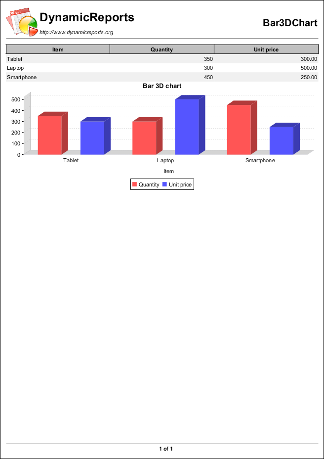

.. |pic3| image:: images/barchartreport.png
   :target: BarChart.html
   :width: 80

.. |pic4| image:: images/bubblechartreport.png
   :target: BubbleChart.html
   :width: 80

.. |pic5| image:: images/candlestickchartreport.png
   :target: CandlestickChart.html
   :width: 80

.. |pic6| image:: images/differencechartreport.png
   :target: DifferenceChart.html
   :width: 80

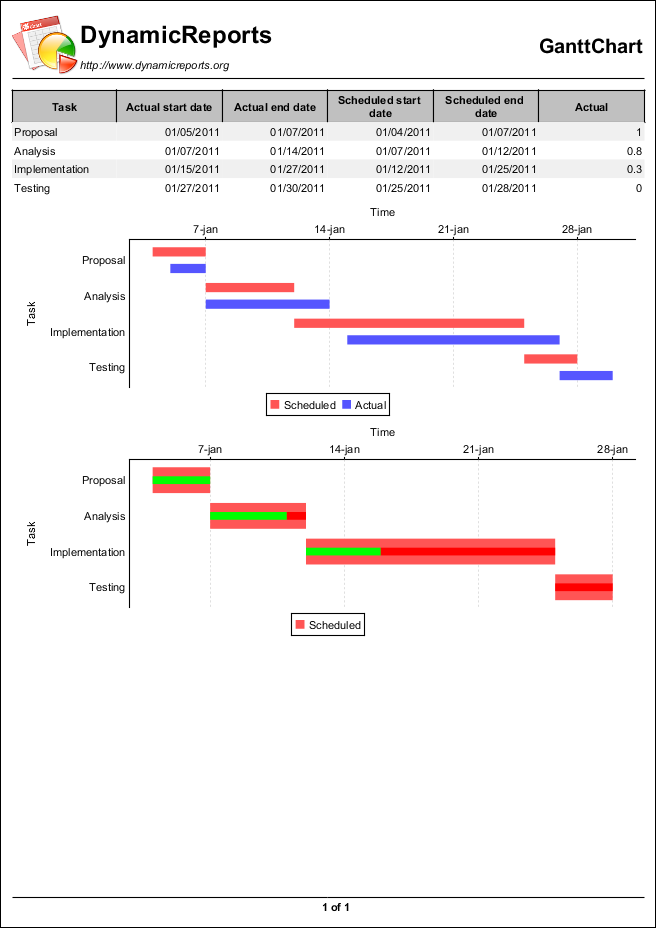

.. |pic8| image:: images/groupedstackedbarchartreport.png
   :target: GroupedStackedBarChart.html
   :width: 80

.. |pic9| image:: images/highlowchartreport.png
   :target: HighLowChart.html
   :width: 80

.. |pic10| image:: images/layeredbarchartreport.png
   :target: LayeredBarChart.html
   :width: 80

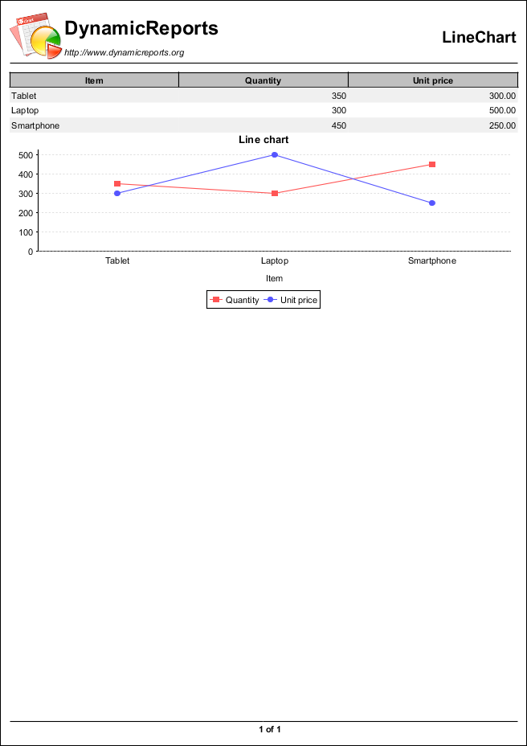

.. |pic12| image:: images/meterchartreport.png
   :target: MeterChart.html
   :width: 80

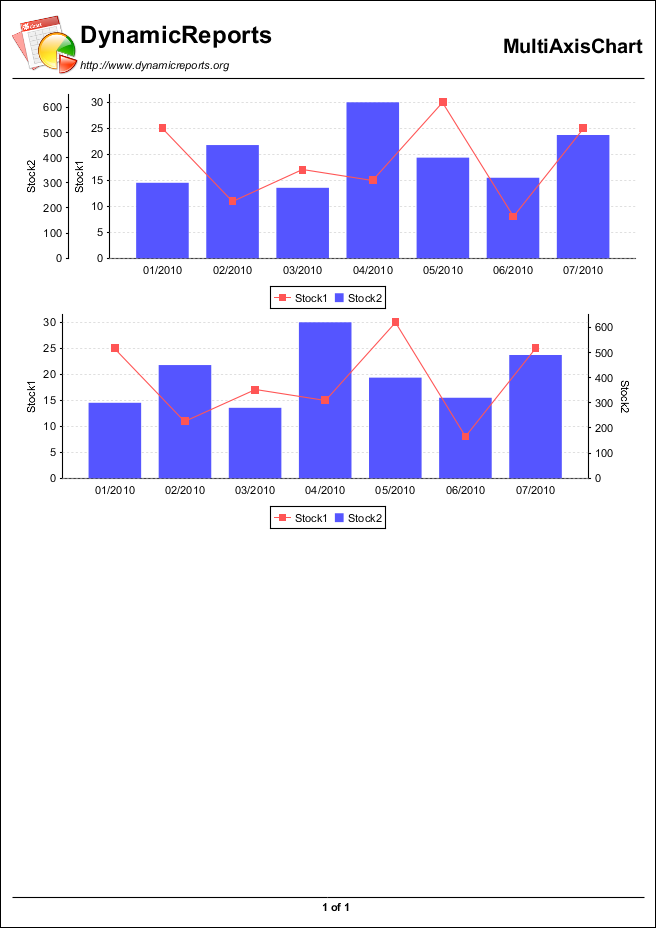

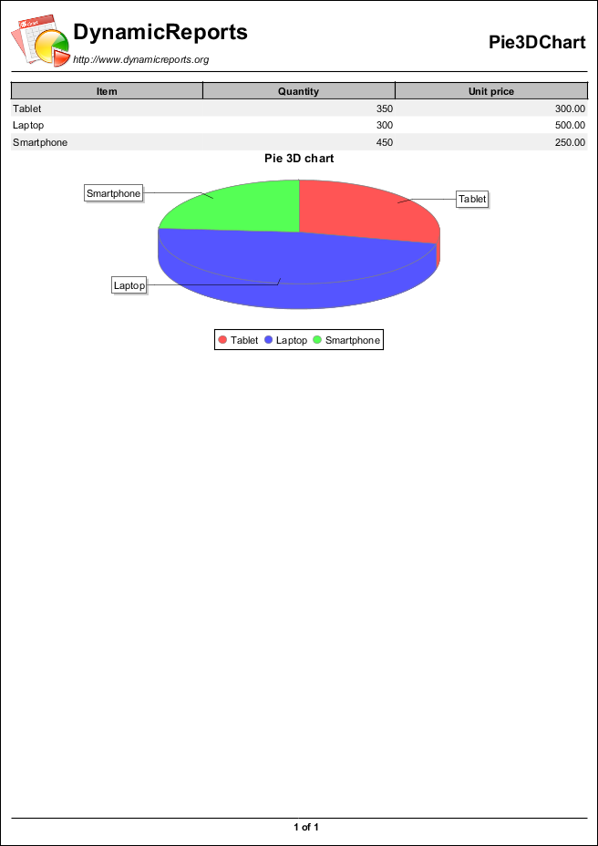

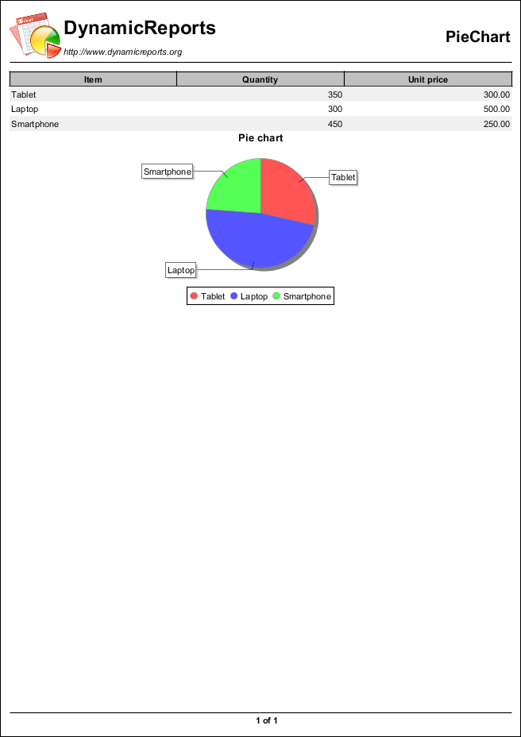

.. |pic16| image:: images/scatterchartreport.png
   :target: ScatterChart.html
   :width: 80

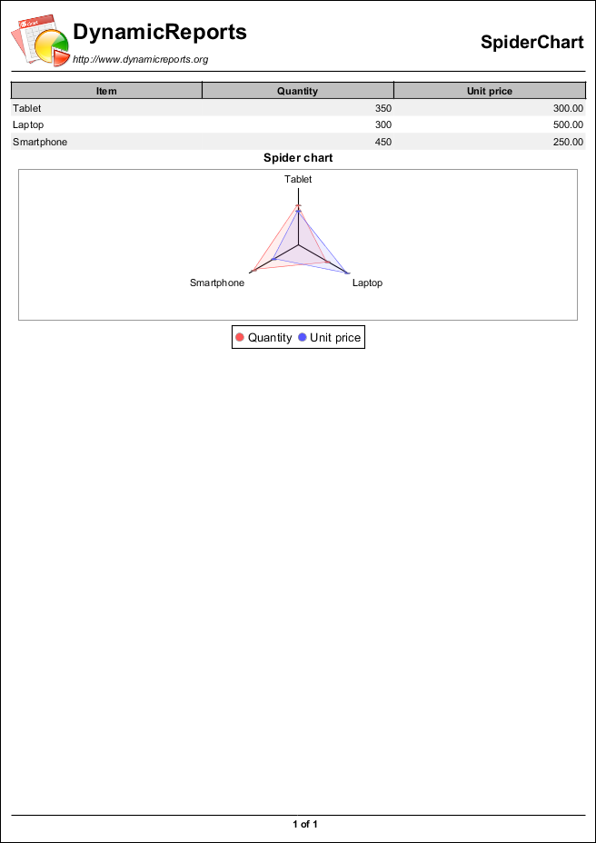

.. |pic18| image:: images/stackedareachartreport.png
   :target: StackedAreaChart.html
   :width: 80

.. |pic19| image:: images/stackedbar3dchartreport.png
   :target: StackedBar3DChart.html
   :width: 80

.. |pic20| image:: images/stackedbarchartreport.png
   :target: StackedBarChart.html
   :width: 80

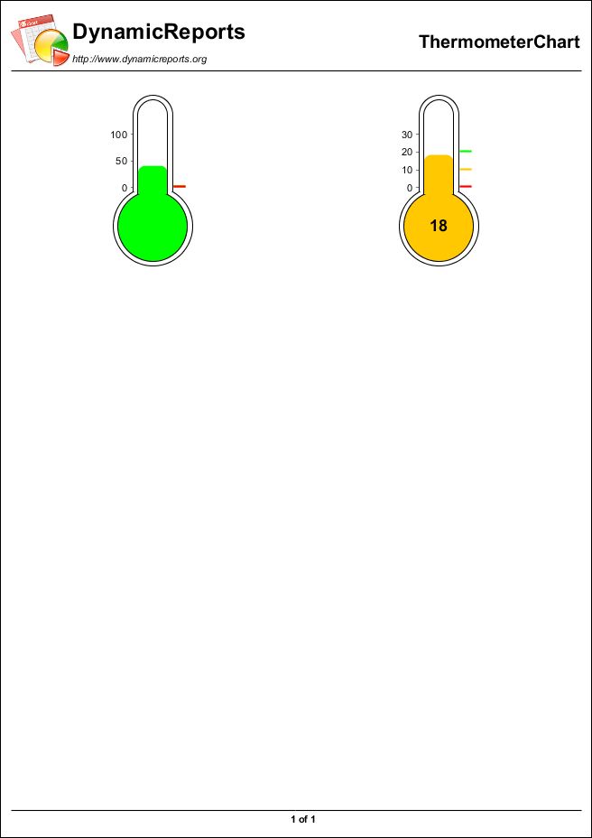

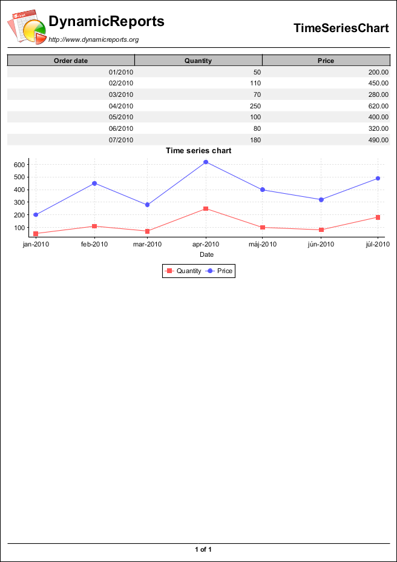

.. |pic23| image:: images/waterfallbarchartreport.png
   :target: WaterfallBarChart.html
   :width: 80

.. |pic24| image:: images/xyareachartreport.png
   :target: XYAreaChart.html
   :width: 80

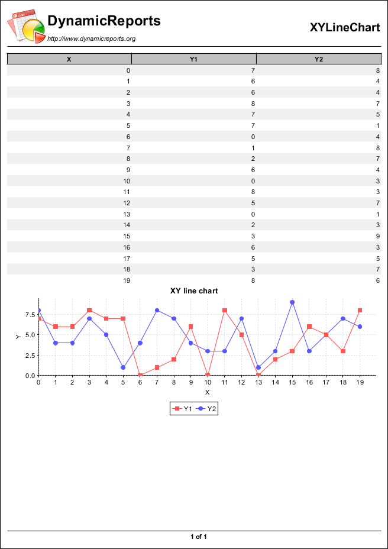

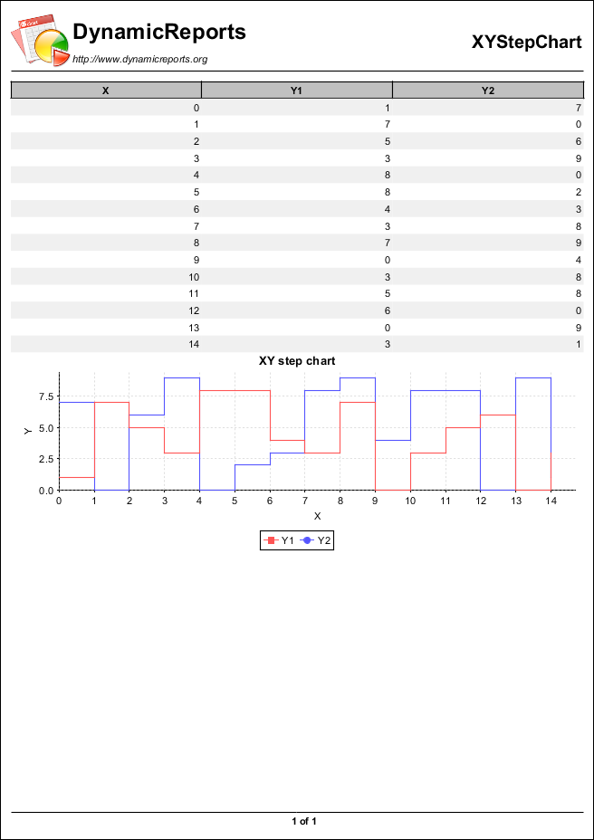

.. |pic27| image:: images/xyblockchartreport.png
   :target: XyBlockChart.html
   :width: 80

