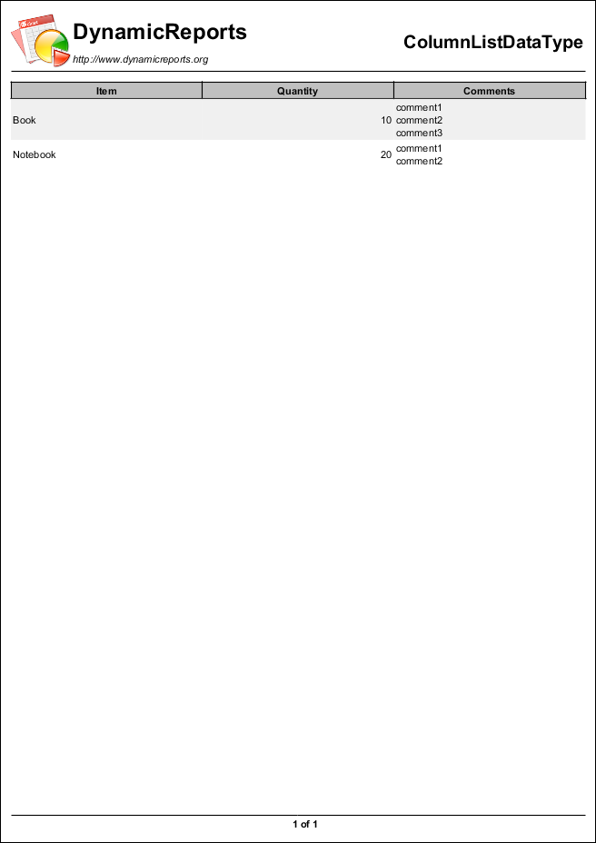
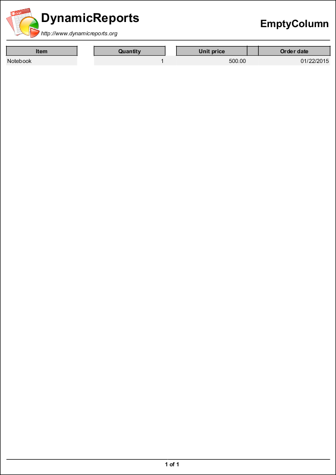
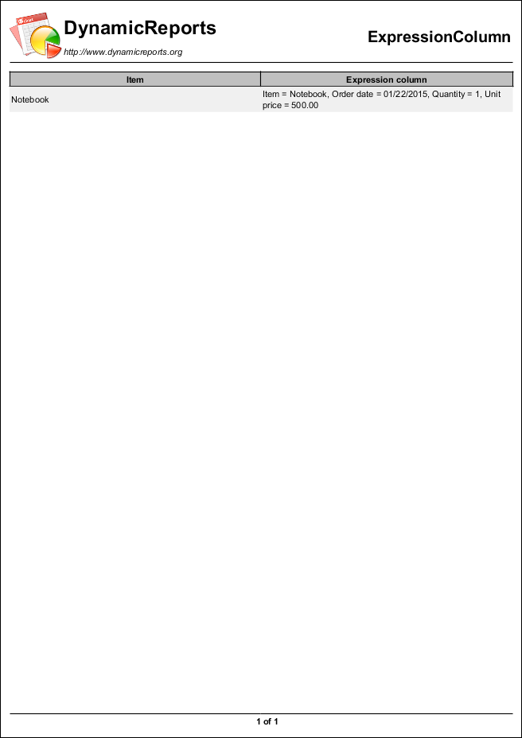

Column
======

.. toctree::
   :hidden:
   :caption: Column:

   BooleanColumnReport
   CalculatedColumnReport
   ColumnDataTypesReport
   ColumnDetectDataTypeReport
   ColumnListDataTypeReport
   ColumnSubreportDataReport
   ComponentColumnReport
   ConversionColumnReport
   EmptyColumnReport
   ExpressionColumnReport
   PercentageColumnsReport
   PercentageColumnWidthReport
   RowNumberColumnsReport

.. table:: Column Examples
   :align: center

   +---------------------------+---------------------------+---------------------------+
   | |pic1|                    | |pic2|                    | |pic3|                    |
   |                           |                           |                           |
   | BooleanColumnReport       | CalculatedColumnReport    | ColumnDataTypesReport     |
   +---------------------------+---------------------------+---------------------------+
   | |pic4|                    | |pic5|                    | |pic6|                    |
   |                           |                           |                           |
   | ColumnDetectDataTypeReport| ColumnListDataTypeReport  | ColumnSubreportDataReport |
   +---------------------------+---------------------------+---------------------------+
   | |pic7|                    | |pic8|                    | |pic9|                    |
   |                           |                           |                           |
   | ComponentColumnReport     | ConversionColumnReport    | EmptyColumnReport         |
   +---------------------------+---------------------------+---------------------------+
   | |pic10|                   | |pic11|                   | |pic12|                   |
   |                           |                           |                           |
   | ExpressionColumnReport    | PercentageColumnsReport   |PercentageColumnWidthReport|
   +---------------------------+---------------------------+---------------------------+
   | |pic13|                   |                           |                           |
   |                           |                           |                           |
   | RowNumberColumnsReport    |                           |                           |
   +---------------------------+---------------------------+---------------------------+

.. |pic1| image:: images/BooleanColumnReport.png
   :target: BooleanColumnReport.html
   :width: 80

.. |pic2| image:: images/CalculatedColumnReport.png
   :target: CalculatedColumnReport.html
   :width: 80

.. |pic3| image:: images/ColumnDataTypesReport.png
   :target: ColumnDataTypesReport.html
   :width: 80

.. |pic4| image:: images/ColumnDetectDataTypeReport.png
   :target: ColumnDetectDataTypeReport.html
   :width: 80

.. |pic6| image:: images/ColumnSubreportDataReport.png
   :target: ColumnSubreportDataReport.html
   :width: 80

.. |pic7| image:: images/ComponentColumnReport.png
   :target: ComponentColumnReport.html
   :width: 80

.. |pic8| image:: images/ConversionColumnReport.png
   :target: ConversionColumnReport.html
   :width: 80

.. |pic11| image:: images/PercentageColumnsReport.png
   :target: PercentageColumnsReport.html
   :width: 80

.. |pic12| image:: images/PercentageColumnWidthReport.png
   :target: PercentageColumnWidthReport.html
   :width: 80

.. |pic13| image:: images/RowNumberColumnsReport.png
   :target: RowNumberColumnsReport.html
   :width: 80

