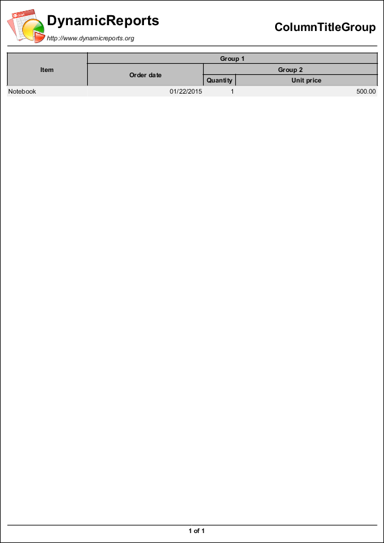

Column Grid
===========

.. toctree::
   :hidden:
   :caption: Chart:

   ColumnGridReport
   ColumnTitleGroupReport
   FlowColumnPairsReport
   ManyColumnsReport
   VerticalColumnsReport
   VerticalValuesReport

.. table:: Chart Examples
   :align: center

   +-------------------+------------------------+-----------------------+
   | |pic1|            | |pic2|                 | |pic3|                |
   |                   |                        |                       |
   | ColumnGridReport  | ColumnTitleGroupReport | FlowColumnPairsReport |
   +-------------------+------------------------+-----------------------+
   | |pic4|            | |pic5|                 | |pic6|                |
   |                   |                        |                       |
   | ManyColumnsReport | VerticalColumnsReport  | VerticalValuesReport  |
   +-------------------+------------------------+-----------------------+

.. |pic1| image:: images/ColumnGridReport.png
   :target: ColumnGridReport.html
   :width: 80

.. |pic3| image:: images/FlowColumnPairsReport.png
   :target: FlowColumnPairsReport.html
   :width: 80

.. |pic4| image:: images/ManyColumnsReport.png
   :target: ManyColumnsReport.html
   :width: 80

.. |pic5| image:: images/VerticalColumnsReport.png
   :target: VerticalColumnsReport.html
   :width: 80

.. |pic6| image:: images/VerticalValuesReport.png
   :target: VerticalValuesReport.html
   :width: 80
