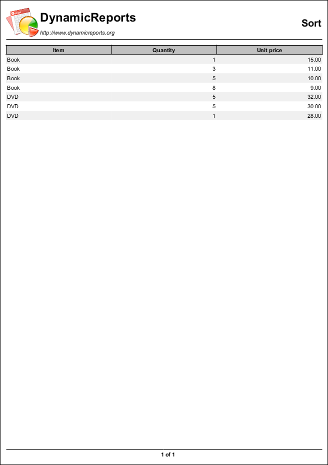
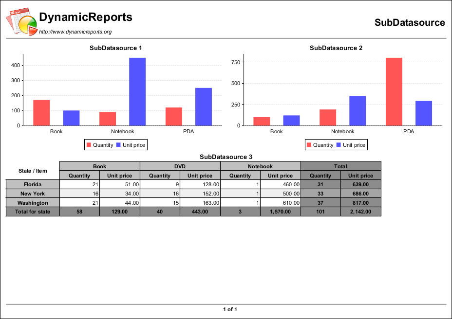

==========
Datasource
==========

.. toctree::
   :hidden:
   :caption: Column:

   CollectionDatasourceReport
   DatabaseDatasourceReport
   DataFilterReport
   SortReport
   SubDatasourceReport
   XmlDatasourceReport

.. table:: Column Examples
   :align: center

   +---------------------------+------------------------------+-------------------------------+
   | |pic1|                    | |pic2|                       | |pic3|                        |
   |                           |                              |                               |
   | CollectionDatasourceReport| DatabaseDatasourceReport     | DataFilterReport              |
   +---------------------------+------------------------------+-------------------------------+
   | |pic4|                    | |pic5|                       | |pic6|                        |
   |                           |                              |                               |
   | SortReport                | SubDatasourceReport          | XmlDatasourceReport           |
   +---------------------------+------------------------------+-------------------------------+

.. |pic1| image:: images/CollectionDatasourceReport.png
   :target: CollectionDatasourceReport.html
   :width: 80

.. |pic2| image:: images/DatabaseDatasourceReport.png
   :target: DatabaseDatasourceReport.html
   :width: 80

.. |pic3| image:: images/DataFilterReport.png
   :target: DataFilterReport.html
   :width: 80

.. |pic6| image:: images/XmlDatasourceReport.png
   :target: XmlDatasourceReport.html
   :width: 80
